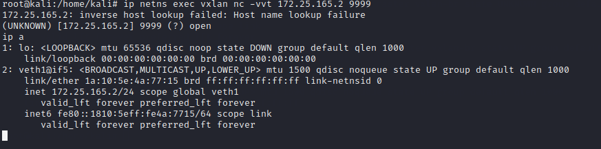
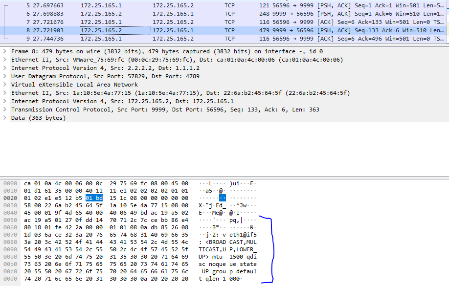

# VXLAN - labolatorium wprowadzające

<!-- Celem zadania jest zasymulowanie sieci L2, tak aby zapewnić wrażenie bycia w jednej sieci usługom, które są fizycznie 
oddzielone urządzeniem L3 - routerem.

Problemy do rozwiązania:
- nie można zrobić arpa
- gdzie są adresy MAC trzymane (consul, etcd)


Dodać definicję:
- overlay i underlay

[typy interfejsów sieciowych](https://developers.redhat.com/blog/2018/10/22/introduction-to-linux-interfaces-for-virtual-networking/) -->


## Przygotowanie topologii

W pierwszym kroku musimy przygotować następującą topologię:


Na każdym hoście:

```sh
# dodawanie IP na interfejsie eth0
ip a add <ip_addr> dev <interface>

# dodawanie domyślnej bramy:
ip r add 0.0.0.0/0 via <ip_gateway>

# podnoszenie interfejsu:
ip l set up dev vxlan0
```

## Konfiguracja VXLAN

Dodajemy interfejs o nazwie `vxlan0`, o vni `88` który używa port udp `4789` do przesyłania opakowanych ramek w nagłówki vxlanowe
```sh
ip l add vxlan0 type vxlan id 88 dstport 4789 proxy nolearning
```

## Tworzymy namespace

```sh
# wykonanie polecenia przy izolacji sieciowej z NS
ip netns exec <nazwa netns> <komenda>

# tworzenie namespace'u o nazwie vxlan
ip netns add vxlan
```

**Zadanie** Sprawdź interfejsy sieciowe w utworzonym ns.

Tworzymy interfejs VETH **(opis dodać)** połączenia namespace'a z domyślnym namespacem:

```sh
ip l add veth0 type veth peer veth1 netns vxlan
```

**Zadanie** Sprawdź interfejsy sieciowe w utworzonym ns.

**Zadanie** Przypisz interfejsowi veth1 adres IP overlay'a. Po nadaniu adresu, należy podnieść interfejs.

## Bridge pomiędzy VETH a VXLAN

Komunikacje wychodzącą z NS mamy już przygotowaną, należy teraz skonfigurować połączenie z interfejsem vxlanowym, który będzie odpowiadał za tunelowanie ruchu sieciowego.

```sh
ip l add <br_int_name> type bridge

# Podpinamy interfejsy sieciowe pod bridge'a
ip l set master <br_int_name> dev veth1
ip l set master <br_int_name> dev vxlan0

#Podnosimy brigde'a
ip l set up dev <br_int_name>
```

**Zadanie** Spróbuj spingować adres z sieci, który fizycznie znajduje się zza routerem. Do debugowania użyj komendy:

```sh
tcpdump -ni vxlan0
```

_(Powinniśmy zobaczyć arpy, na które nikt nie odpowiada)_

W tym celu należy statycznie uzupełnić adresy MAC:

Wstępnie spróbujmy uzupełnić jakiś fałszywy adres MAC, aby sprawdzić czy interfejs vxlan odpowie na ARP'a w imieniu remote. Opcja `proxy`, przy tworzeniu interfejsu vxlanowego odpowiada za skonfigurowanie tej funkcjonalności.

```sh
ip n add 172.25.165.2 lladdr 00:01:02:03:04:05 dev vxlan0
```

Czy host dostał odpowiedź na pinga?

_(Dostaliśmy odpowiedź ARP, natomiast ICMP timeoutuje)_

```sh
root@kali:/home/kali tcpdump -ni vxlan0
tcpdump: verbose output suppressed, use -v or -vv for full protocol decode
listening on vxlan0, link-type EN10MB (Ethernet), capture size 262144 bytes
13:05:24.785640 ARP, Request who-has 172.25.165.2 
tell 172.25.165.1, length 28


13:05:24.785655 ARP, Reply 172.25.165.2 is-at 00:01:02:03:04:05, length 28


13:05:24.785664 IP 172.25.165.1 > 172.25.165.2: ICMP echo request, id 35349, seq 1, length 64
13:05:25.803201 IP 172.25.165.1 > 172.25.165.2: ICMP 
...
```

Natomiast na interfejsie fizycznym `eth0`, dalej nie ma ruchu.

## Tabela FDB interfejsu VXLAN

W kolejnym kroku dodajemy wpis interfejsowi vxlanowemu, gdzie znajduje się host o danym adresie MAC:

<!-- Opisać metodę mutlicast, statyczne wpisy oraz dynamieczne uzupełnianie tabeli -->

W poniższym przykładzie wykorzystujemy flooding - wysyłanie do wszystkich końcówek tunelu
```sh
# Dla każdej underlayowej końcówki dajemy taki wpis
bridge fdb append 00:00:00:00:00:00 dev vxlan0 dst <underlayowy IP>
```

Po dodaniu tego wpisu sprawdź ruch na kablu pomiędzy hostem a Routerem.


Jest to datagram UDP, pomiędzy hostami z sieci underlayowej. 

W zakładce Ethernet II możemy zauważyć adres MAC maszyny za routerem.

**Zadanie**
Sprawdź czy VNI się zgadza? 
Czy adresy Overlayowe się zgadzają?


## Konfiguracja drugiego hosta

Zadanie polega na analogicznym skonfigurowaniu drugiego hosta, pamiętaj tym razem o poprawnym ustawieniu adresów MAC na obu hostach.

## Po uzyskaniu łączności IP
Aby zasymulować działanie usług warstw wyższych możemy zacząć nasłuchiwanie netcatem:
```sh
ip netns exec vxlan nc -vvlt -p 9999 -e /bin/bash
```

Po drugiej stronie:

```sh
ip netns exec vxlan nc -vvt <adres drugiego komputera> 9999
```

Powinniśmy otrzymać shell na drugim komputerze:


Analiza pakietów w Wiresharku pozwala na oględziny przesłanych danych(output komendy `ip a`):


# Authors

- Mirosław Błażej
- Michał Dygas
- Dawid Macek
- Piotr Wróbel
