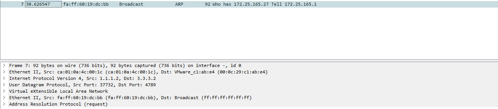

# VXLAN - laboratorium wprowadzające

VxLAN (Virtual Extensible LAN) jest standardem wirtualizacji sieci opisanym w [RFC 7348](https://tools.ietf.org/html/rfc7348). Umożliwia on stworzenie wirtualnego segmentu sieci L2, maskując fakt przedzielenia urządzeniem L3. Pozwala on tworzyć izolowane i skalowalne sieci wirtualne bez ograniczeń, które posiada VLAN. Zasięg VLANu ograniczał się tylko do urządzeń warstwy L2 w obrębie pojedynczego segmentu sieci. VxLAN jest korzystny z punktu widzenia fizycznej infrastruktury ze względu na rozłożenie enkapsulacji na urządzenia warstwy drugiej oraz warstwy trzeciej.

## Interfejsy sieciowe w Linuxie

Linux udostępnia wiele różnych interfejsów sieciowych:
- Fizyczne (*ethX*, *ensXX*, *wlanX*, itp.) - reprezentują fizyczny interfejs urządzenia, rozmawiają bezpośrednio ze sterownikami urządzeń.
- Wirtualne - realizują pewną funkcjonalność, ale nie korzystają bezpośrednio ze sprzętu. Do tej grupy zaliczamy mosty, pary veth, interfejsty tun/tap, itd.

Wraz z rozwojem wirutalizacji wzrosło znaczenie interfejsów wirtualnych. 
W tym laboratorium będziemy symulować topologię, która jest zwykle tworzona przez Dockera(najczęściej stosowane narzędzie do konteneryzacji).
Będzie ona wykorzystywała bridge, parę veth oraz interfejs VTEP(o którym później).

### Most (Bridge)

System Linux udostępnia wiele możliwości tworzenia wirtualnych sieci działających w ramach jednej maszyny. Jednym z udostępnionych mechanizmów jest **bridge**, którego działanie zbliżone jest do fizycznego switch - przekazuje pakiety pomiędzy przyłączonymi do niego interfejsami. Może być wykorzystany do połączenia ze sobą maszyn wirtualnych. Wspiera protokół STP oraz stosowanie list dostępu do VLAN-ów.

Przykładowo: na komputerze mamy dostępne 3 wirtualne środowiska, które chcemy połączyć ze sobą oraz z zewnętrzną siecią (dostępną na interfejsie eth0). Tworzymy bridge oraz dołączmy do niego urządzenia za pomocą następujących komend:

```
ip l add br0 type bridge
ip l set br0 up

ip l set eth0 master br0

ip l set tap1 up
ip l set tap1 master br0

ip l set tap2 up
ip l set tap2 master br0

ip l set veth1 up
ip l set veth1 master br0
```

W rezultacie otrzymujemy połączenie przedstawione na poniższym schemacie:


*źródło grafiki: https://developers.redhat.com/blog/2018/10/22/introduction-to-linux-interfaces-for-virtual-networking/*

Do odłączenia interfejsów od bridge'a służy polecenie:
```
ip l set nazwa_interfejsu nomaster
```

Bridge usuwany jest z systemu za pomocą polecenia:
```
ip l del nazwa_bridge'a
```

### VEth (Virtual Ethernet)

VEth jest wirtualnym łączem Ethernet, tworzy się odpowiednie pary wirtualnych urządzeń stanowiące końce połączenia. Pakiety, które zostały wysłane przez jeden z końców automatycznie przychodza na drugi z nich.

Łącze VEth tworzy się za pomocą komendy:
```
ip l add nazwa1 type veth peer name nazwa2
```

Inną możliwością, jest utworzenie przestrzeni nazw do których przypisane zostaną odpowiednie końce połączenia, wymaga to modyfikacji komend:
```
ip netns add przestrzen1
ip netns add przestrzen2
ip l add veth1 netns przestrzen1 type veth peer name veth2 netns przestrzen2
```

**Uwaga:** przy zadeklarowaniu przestrzeni nazw i przypisaniu do niej interfejsu aby wykonać polecenia w tej przestrzeni należy komendy poprzedzić (przedstawione w przykładzie dalej):
```
ip netns exec nazwa_przestrzeni komenda_do_wykonania
```

Przykładowe połączenie z użyciem bridge'a przedstawia poniższy rysunek:


*źródło grafiki: https://developers.redhat.com/blog/2018/10/22/introduction-to-linux-interfaces-for-virtual-networking/*


Po przypisaniu adresów IP do interfejsów można zweryfikować działanie połączenia za pomocą pinga, przykład konfiguracji:
```
ip netns add przestrzen1
ip netns add przestrzen2

ip link add veth1 netns przestrzen1 type veth peer name veth2 netns przestrzen2

ip netns exec przestrzen1 ip l set dev veth1 up
ip netns exec przestrzen2 ip l set dev veth2 up

ip netns exec przestrzen1 ip a add 10.0.0.1/24 dev veth1
ip netns exec przestrzen2 ip a add 10.0.0.2/24 dev veth2

ip netns exec przestrzen1 ping -I veth1 10.0.0.2
ip netns exec przestrzen2 ping -I veth2 10.0.0.1
```

Interfejsy VEth można usuwać za pomocą `ip l delete` (wystarczy usunąć tylko jeden koniec, drugi zostanie usunięty automatycznie, dla przestrzeni nazw trzeba komendę oczywiście poprzedzić `ip netns exec nazwa_przestrzeni`):
```
ip l delete veth1
```

Przestrzeń nazw usuwamy analogicznie, używając `ip netns delete`:
```
ip netns delete przestrzen1
ip netns delete przestrzen2
```

## Zasada działania


*przykład ramki, która zostałą już zenkapsulowana przez nagłówek VXLANowy*

Upraszczając działanie, VXLAN jest protokołem, który tuneluje Ethernet. Opakowuje ramkę ethernet w datagram UDP z kilkoma dodatkowymi nagłówkami, wymaganymi do poprawnego tunelowania. W skład tych nagłówków wchodzą:

- **8 bitów** zarezerwowane na potrzeby przyszłych zastosowań, wszystkie wyzerowane
- **24 bity** VNI (VXLAN Network ID) 
- **24 bity** zarezerwowane na potrzeby przyszłych zastosowań, 
- **8 bitów** flagi ustawionych na 0 z wyjątkiem bitu trzeciego, który jest ustawiony na binarne 1 i oznacza poprawny nagłówek VxLAN

Dowiedzmy się teraz co kryje się za terminologią wykorzystywaną w VxLANach.
## VNI (VxLAN Network Identifier)

Tag identyfikujący segment sieci, do którego przynależy dana usługa. Semantycznie ma analogiczne znaczenie co VLAN ID, do którego przynależy ramka. 
W przypadku VLANów na tag poświęcone jest 12 bitów, co daje nam możliwość ponumerowania 4095 VLANów (4096 możliwości, ale VLAN 0 jest wyłączony z użytku). Natomiast na tag VNI zostały przeznaczone aż 24 bity co pozwala nam na zaadresowanie aż 16 777 215 segmentów sieci.

## VTEP (VXLAN tunnel endpoint)

Wirtualny interfejs odpowiedzialny za enkapsulacje ramek w nagłówki VxLANowe.
Przy tworzeniu VTEPu w Linuxie mamy możliwość ustawienia wielu opcji.
Postaramy się wyjaśnić używane opcje, natomiast resztę można znaleźć w [ip-link(8)](https://man7.org/linux/man-pages/man8/ip-link.8.html).

W implementacji Linuxowej jeden VTEP może działać tylko w jednym VNI.
Jeśli chcemy wykorzystać większą liczbę VNIów po prostu tworzymy kolejne interfejsy.

## Overlay/Underlay

Przy wdrażaniu tego rozwiązania warto podzielić elementy sieciowe względem ich funkcjonalności w systemie. 
**Sieć underlay** zapewnienia komunikację na poziome warstwy trzeciej pomiędzy hostami posiadającymi VTEPy. Najczęściej jest to sieć fizyczna.
**Sieć overlay** to sieć wirtualizowana, która używa do transmisji sieci underlay. Umożliwia współdziałanie wielu usług w jednym segmencie L2, gdzie w rzeczywistości różne usługi mogą być rozproszone np. na serwerach od dwóch różnych dostawców. 

## Problem - Przesyłanie ruchu BUM(Broadcast, Unknown Unicast, Multicast)

Po konfiguracji VTEPu nie wie on pod jakim adresem underlayowym znajdują się pozostałe VTEPy.
Skutkuje to odcięciem od segmentu sieci L2.

Jak rozwiązać ten problem?

- **Użycie Multicastu** - VTEP po włączeniu wykorzysta IGMP do dołączenia do grupy multicastowej. Jeśli sieć underlayowa wspiera multicast to problem jest rozwiązany z automatu.
- **Statyczne ustalenie VTEPów** - rozwiązanie mało skalowalne, ale umożliwia użycie underlaya który nie wspiera multicastu.
- **Dynamicnze uzupełnianie statycznych wpisów** - używamy deamona, który będzie w stanie pobrać informacje z zewnętrznej bazy danych i automatycznie uzupełnić informacje o pozostałych VTEPach. Do ustalenia pozycji pozostałych VTEPów można również użyć technologii BGP EVPN.


[typy interfejsów sieciowych](https://developers.redhat.com/blog/2018/10/22/introduction-to-linux-interfaces-for-virtual-networking/)  -->

# Przykład 1

## Przygotowanie topologii

W pierwszym kroku musimy przygotować następującą topologię:


Na każdym hoście:

```sh
# dodawanie IP na interfejsie eth0
ip a add <ip_addr> dev <interface>

# dodawanie domyślnej bramy:
ip r add 0.0.0.0/0 via <ip_gateway>

# podnoszenie interfejsu:
ip l set up dev vxlan0
```

## Konfiguracja VXLAN

Dodajemy interfejs o nazwie `vxlan0`, o vni `88` który używa port udp `4789` do przesyłania opakowanych ramek w nagłówki vxlanowe.
Opcja `proxy` powoduje, że VTEP odpowiada na ARPy używając własnej tablicy ARP - nie przekazuje zapytań dalej.
Opcja `nolearning` wyłącza source-address learning, który pozwala na skojarzenie overlayowego adresu MAC z underlayowym adresem IP.
Powyższe opcje wymuszą na nas konfigurację wielu rzeczy ręcznie, ale pozwolą na lepsze zrozumienie tego co się dzieje.
```sh
ip l add vxlan0 type vxlan id 88 dstport 4789 proxy nolearning
```

## Tworzymy namespace

```sh
# wykonanie polecenia przy izolacji sieciowej z NS
ip netns exec <nazwa netns> <komenda>

# tworzenie namespace'u o nazwie vxlan
ip netns add vxlan
```

**Zadanie** Sprawdź interfejsy sieciowe w utworzonym ns.

Tworzymy interfejs VETH **(opis dodać)** połączenia namespace'a z domyślnym namespacem:

```sh
ip l add veth0 type veth peer veth1 netns vxlan
```

**Zadanie** Sprawdź interfejsy sieciowe w utworzonym ns.

**Zadanie** Przypisz interfejsowi veth1 adres IP overlay'a. Po nadaniu adresu, należy podnieść interfejs.

## Bridge pomiędzy VETH a VXLAN

Komunikacje wychodzącą z NS mamy już przygotowaną, należy teraz skonfigurować połączenie z interfejsem vxlanowym, który będzie odpowiadał za tunelowanie ruchu sieciowego.

```sh
ip l add <br_int_name> type bridge

# Podpinamy interfejsy sieciowe pod bridge'a
ip l set master <br_int_name> dev veth1
ip l set master <br_int_name> dev vxlan0

#Podnosimy brigde'a
ip l set up dev <br_int_name>
```

**Zadanie** Spróbuj spingować adres z sieci, który fizycznie znajduje się zza routerem. Do debugowania użyj komendy:

```sh
tcpdump -ni vxlan0
```

_(Powinniśmy zobaczyć arpy, na które nikt nie odpowiada)_

W tym celu należy statycznie uzupełnić adresy MAC:

Wstępnie spróbujmy uzupełnić jakiś fałszywy adres MAC, aby sprawdzić czy interfejs vxlan odpowie na ARP'a w imieniu remote. Opcja `proxy`, przy tworzeniu interfejsu vxlanowego odpowiada za skonfigurowanie tej funkcjonalności.

```sh
ip n add 172.25.165.2 lladdr 00:01:02:03:04:05 dev vxlan0
```

Czy host dostał odpowiedź na pinga?

_(Dostaliśmy odpowiedź ARP, natomiast ICMP timeoutuje)_

```sh
root@kali:/home/kali tcpdump -ni vxlan0
tcpdump: verbose output suppressed, use -v or -vv for full protocol decode
listening on vxlan0, link-type EN10MB (Ethernet), capture size 262144 bytes
13:05:24.785640 ARP, Request who-has 172.25.165.2 
tell 172.25.165.1, length 28


13:05:24.785655 ARP, Reply 172.25.165.2 is-at 00:01:02:03:04:05, length 28


13:05:24.785664 IP 172.25.165.1 > 172.25.165.2: ICMP echo request, id 35349, seq 1, length 64
13:05:25.803201 IP 172.25.165.1 > 172.25.165.2: ICMP 
...
```

Natomiast na interfejsie fizycznym `eth0`, dalej nie ma ruchu.

## Tabela FDB interfejsu VXLAN

W kolejnym kroku dodajemy wpis interfejsowi vxlanowemu, gdzie znajduje się host o danym adresie MAC:

<!-- Opisać metodę mutlicast, statyczne wpisy oraz dynamieczne uzupełnianie tabeli -->

W poniższym przykładzie wykorzystujemy flooding - wysyłanie do wszystkich końcówek tunelu
```sh
# Dla każdej underlayowej końcówki dajemy taki wpis
bridge fdb append 00:00:00:00:00:00 dev vxlan0 dst <underlayowy IP>
```

Po dodaniu tego wpisu sprawdź ruch na kablu pomiędzy hostem a Routerem.


Jest to datagram UDP, pomiędzy hostami z sieci underlayowej. 

W zakładce Ethernet II możemy zauważyć adres MAC maszyny za routerem.

**Zadanie**
Sprawdź czy VNI się zgadza? 
Czy adresy Overlayowe się zgadzają?


## Konfiguracja drugiego hosta

Zadanie polega na analogicznym skonfigurowaniu drugiego hosta, pamiętaj tym razem o poprawnym ustawieniu adresów MAC na obu hostach.

## Po uzyskaniu łączności IP
Aby zasymulować działanie usług warstw wyższych możemy zacząć nasłuchiwanie netcatem:
```sh
ip netns exec vxlan nc -vvlt -p 9999 -e /bin/bash
```

Po drugiej stronie:

```sh
ip netns exec vxlan nc -vvt <adres drugiego komputera> 9999
```

Powinniśmy otrzymać shell na drugim komputerze:


Analiza pakietów w Wiresharku pozwala na oględziny przesłanych danych(output komendy `ip a`):


**W tym momencie zrób problem 1**

# Przykład 2
Jak zrobić aby nie trzeba było ręcznie wpisywać MACów, tylko żeby całość przebiegała automatycznie?

Tworzymy VTEP używając następujących opcji:
```sh
ip l add vxlan0 type vxlan id 88 dstport 4789 noproxy nolearning
```
Jedyną różnicą jest opcja `noproxy` - teraz VTEP będzie przekazywał ramki ARPowe dalej, zamiast samemu na nie odpowiadać.

Teraz dla każdej końcówki tunelu uzupełniamy wpisy za pomocą `bridge fdb`:
```sh
bridge fdb append 00:00:00:00:00:00 dev vxlan0 dst <underlayowy IP>
```

Uruchamiamy Wiresharka na którymś z linków, a następnie pingujemy z komputera jakiś adres z sieci overlayowej.


**W tym momencie zrób problem 2 i 3**

# Problem 1
Przypminij do routera kolejny komputer, ale tym razem podczas konfiguracji VXLANU nie twórz własnego namespacu, tylko spróbuj wykorzystać do tego dockera z jakąś usługą.


Aby uruchomić kontener bez żadnego networkingu(zostanie stworzony pusty namespace):
```
docker run --rm -dit \
  --network none \
  --name <nazwa_konternera> \
  <nazwa_obrazu> \
  /bin/bash
```

Komenda `ip netns ls` nie pokaże żadnej nowej przestrzeni nazw, ponieważ brakuje symbolicznych linków.
Aby utworzyć je ręcznie:
- Znajdź PID procesu: `docker inspect <id kontenera> | grep -i PID `
- Stwórz symboliczny link: `ln -sfT /proc/<znaleziony_pid>/ns/net /var/run/netns/<nazwa-po-jakej-chcemy-zwracać-się-do-namespace>`
- Jeśli katalog /var/run/netns nie istnieje, stwórz go.

Po konfiguracji VXLANu najprawdopodobniej wystąpi konieczneść restartu usługi w nim uruchomionej, tak aby korzystała ze stworzonego interfejsu.

# Problem 2
Podczas komunikacji pomiędzy pierwszym i drugim komputerem zaobserwuj co się dzieje na linku pomiędzy routerem a trzecim komputerem.
Ponieważ stosujemy zalewanie cała komunikacja jest wysyłana również do trzeciego hosta.

Spróbuj naprawić ten problem wykorzystując opcję `learning` przy tworzeniu VTEPa. Sprawdź jak zmienia się zawartość tablic fdb na hostach(polecenie `bridge fdb show dev <nazwa interfejsu>`):
- Przed rozpoczęciem jakiejkolwiek komunikacji - _powinny być tylko wpisy 00:00:00:00:00:00_
- Po spingowaniu drugiego hosta z pierwszego hosta
- Po spingowaniu pierwszego hosta z drugiego hosta

**Uwaga**
Powinniśmy wyłączyć IPv6, aby host nie próbował wysyłać ramek używanych przy autokonfiguracji `sysctl -w net.ipv6.conf.all.disable_ipv6=1`.
Na potrzeby tego zadania należy również wyłączyć wszystkie usługi, które mogą próbować automatycznie wysłać coś po włączeniu interfejsu.
Przykładem takiej usługi może być *avahi-deamon*.

Konfiguracja na hoście 1 (_1.1.1.2_):
```sh
ip l add vxlan0 type vxlan id 88 dstport 4789 noproxy learning
ip a add 172.25.165.1/24 dev vxlan0
ip l set up vxlan0
bridge fdb append 00:00:00:00:00:00 dev vxlan0 dst 2.2.2.2
bridge fdb append 00:00:00:00:00:00 dev vxlan0 dst 3.3.3.2
```

Konfiguracja na hoście 2 (_2.2.2.2_):
```sh
ip l add vxlan0 type vxlan id 88 dstport 4789 noproxy learning
ip a add 172.25.165.2/24 dev vxlan0
ip l set up vxlan0
bridge fdb append 00:00:00:00:00:00 dev vxlan0 dst 1.1.1.2
bridge fdb append 00:00:00:00:00:00 dev vxlan0 dst 3.3.3.2
```

Konfiguracja na hoście 3 (_3.3.3.2_):
```sh
ip l add vxlan0 type vxlan id 88 dstport 4789 noproxy learning
ip a add 172.25.165.3/24 dev vxlan0
ip l set up vxlan0
bridge fdb append 00:00:00:00:00:00 dev vxlan0 dst 1.1.1.2
bridge fdb append 00:00:00:00:00:00 dev vxlan0 dst 2.2.2.2
```

**Oczekiwane wpisy przed rozpoczęciem komunikacji:**
```
Host 1:
00:00:00:00:00:00 dst 2.2.2.2 self permanent
00:00:00:00:00:00 dst 3.3.3.2 self permanent
Host 2:
00:00:00:00:00:00 dst 1.1.1.2 self permanent
00:00:00:00:00:00 dst 3.3.3.2 self permanent
Host 3:
00:00:00:00:00:00 dst 1.1.1.2 self permanent
00:00:00:00:00:00 dst 2.2.2.2 self permanent
```

**Po spingowaniu hosta 2 przez 1:**
```
Host 1:
00:00:00:00:00:00 dst 2.2.2.2 self permanent
00:00:00:00:00:00 dst 3.3.3.2 self permanent
42:26:25:8c:36:3b dst 2.2.2.2 self            <- MAC hosta 2
Host 2:
00:00:00:00:00:00 dst 1.1.1.2 self permanent
00:00:00:00:00:00 dst 3.3.3.2 self permanent
fa:ff:60:19:dc:bb dst 1.1.1.2 self            <- MAC hosta 1
Host 3:
00:00:00:00:00:00 dst 1.1.1.2 self permanent
00:00:00:00:00:00 dst 2.2.2.2 self permanent
fa:ff:60:19:dc:bb dst 1.1.1.2 self            <- MAC hosta 1
```

Host 3 otrzymał ARPa wysłanego prez Hosta 1, dlatego otrzymał wpis z jego adresem MAC.


**Po spingowaniu hosta 1 przez 2:**
Sytuacja bez zmian. Host 2 nie broadcastował ramki, tylko wysłał ją bezpośrednio do Hosta 1.

# Problem 3
Spróbuj skonfigurować VXLAN używając metody z multicastem. 

```sh
ip l add vxlan0 type vxlan id 88 dstport 4789 group 224.4.4.4 dev eth0
ip a add 172.25.165.1/24 dev vxlan0
ip l set up vxlan0
```

Opcja `group <..>` określa grupę multicastową, której użyjemy do wysyłania ramek. 
Opcja `dev <..>` określa przez, który interfejs dołączymy za pomocą IGMP do grupy multicastowej.

Po postawieniu interfejsu możemy zauważych ruch IGMP.


Co się dzieje przy próbie spingowania innego VTEPu na linku pomiędzy hostem pingującym a routerem i na linku pomiędzy routerem a hostem pingowanym?


Router nie routuje multicastowych pakietów, musimy go skonfigurować:
```sh
ip multicast-routing 

int fa0/0 
ip pim sparse-dense-mode 

...
```

Czy teraz zachodzi komunikacja?
Nie? 
Zajrzyj w pole TTL - systemy Linuxowe wysyłają pakiety broadcastowe/multicastowe z wartością jeden. Pakiet jest dropiony na routerze. 

Aby to naprawić możemy użyć regułki iptables:
```sh
iptables -t mangle -A OUTPUT -d 224.4.4.4 -j TTL --ttl-set 128
```

Sprawdź czy teraz komunikacja zadziała. Drugi host powinien odpowiedzieć adresem unicastowym. Wniosek jest taki, że multicast używany jest tylko dla ruchu BUM.


Jakie zalety oferuje ta metoda w porównaniu do wcześniej opisanych?
Dlaczego nie możemy zastosować tej metody w Internecie?

# Źródła

- https://developers.redhat.com/blog/2018/10/22/introduction-to-linux-interfaces-for-virtual-networking/
- https://wiki.archlinux.org/index.php/Network_bridge
- https://man7.org/linux/man-pages/man4/veth.4.html
- https://www.cisco.com/c/en/us/support/docs/ip/ip-multicast/9356-48.html

# Authors

- Mirosław Błażej
- Michał Dygas
- Dawid Macek
- Piotr Wróbel
