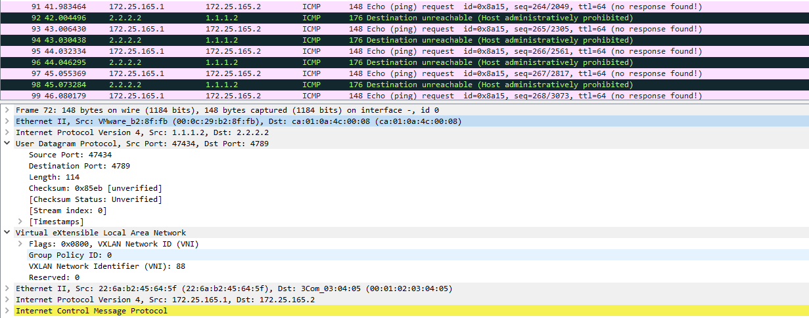

# VXLAN - laboratorium wprowadzające

VxLAN (Virtual Extensible LAN) jest standardem wirtualizacji sieci opisanym w [RFC 7348](https://tools.ietf.org/html/rfc7348). Umożliwia on zasymulowanie sieci na poziomie L2, maskując fakt przedzielenia urządzeniem L3. Pozwala on tworzyć izolowane i skalowalne sieci wirtualne bez ograniczeń, które posiada VLAN. Zasięg VLANu ograniczał się tylko do urządzeń warstwy L2 w obrębie pojedynczego segmentu sieci. VxLAN jest korzystny z punktu widzenia fizycznej infrastruktury ze względu na rozłożenie enkapsulacji na urządzenia warstwy drugiej oraz warstwy trzeciej.

## Zasada działania


*przykład ramki, która zostałą już zenkapsulowana przez nagłówek VXLANowy*

Upraszczając działanie, VXLAN jest protokołem, który tuneluje Ethernet. Opakowuje ramkę ethernet w datagram UDP z kilkoma dodatkowymi nagłówkami, wymaganymi do poprawnego tunelowania. W skład tych nagłówków wchodzą:

- **8 bitów** zarezerwowane na potrzeby przyszłych zastosowań, wszystkie wyzerowane
- **24 bity** VNI (VXLAN Network ID) 
- **24 bity** zarezerwowane na potrzeby przyszłych zastosowań, 
- **8 bitów** flagi ustawionych na 0 z wyjątkiem bitu trzeciego, który jest ustawiony na binarne 1 i oznacza poprawny nagłówek VxLAN

Dowiedzmy się teraz co kryje się za terminologią wykorzystywaną w VxLANach.
## VNI (VxLAN Network Identifier)

Tag identyfikujący segment sieci, do którego przynależy dana usługa. Semantycznie ma analogiczne znaczenie co VLAN ID, do którego przynależy ramka. 
W przypadku VLANów na tag poświęcone jest 12 bitów, co daje nam możliwość ponumerowania 4095 VLANów (4096 możliwości, ale VLAN 0 jest wyłączony z użytku). Natomiast na tag VNI zostały przeznaczone aż 24 bity co pozwala nam na zaadresowanie aż 16 777 215 segmentów sieci.

## Overlay/Underlay

Przy wdrażaniu tego rozwiązania warto podzielić elementy sieciowe względem ich funkcjonalności w systemie. Elementy należące do **sieci underlay** mają za zadanie m.in.: zapewnić komunikację czy zbierać adresy MAC. Elementy zapewniają transparencję w komunikacji usługom należącym do sieci wirtualizowanej. Elementy komunikujące się poprzez wirtualizowaną sieć nalezą do **sieci overlay**.

## Problematyka

Elementy infrastruktury VxLANowej muszą zapewnić transparencje lokalizacji hostów w sieci underlayowej. Co za tym idzie w przypadku próby ustalenia adresu MAC hosta, znajdującego się innym segmencie sieci adres MAC hosta powinien być poprawnie zwrócony. Elementy cześci underlay muszą implementować mechanizmy umożliwiające zbieranie informacji o hostach w wirtualizowanej sieci 

## Elementy infrastruktury VxLAN

Tutaj o tych VTEP i innych rzeczach - na co i po co to komu?


## Tablice FWB (prosze to poprawic)

opisać sposoby zbierania MAC

<!-- Problemy do rozwiązania:
- nie można zrobić arpa
- gdzie są adresy MAC trzymane (consul, etcd)


[typy interfejsów sieciowych](https://developers.redhat.com/blog/2018/10/22/introduction-to-linux-interfaces-for-virtual-networking/)  -->

# Przykład

## Przygotowanie topologii

W pierwszym kroku musimy przygotować następującą topologię:


Na każdym hoście:

```sh
# dodawanie IP na interfejsie eth0
ip a add <ip_addr> dev <interface>

# dodawanie domyślnej bramy:
ip r add 0.0.0.0/0 via <ip_gateway>

# podnoszenie interfejsu:
ip l set up dev vxlan0
```

## Konfiguracja VXLAN

Dodajemy interfejs o nazwie `vxlan0`, o vni `88` który używa port udp `4789` do przesyłania opakowanych ramek w nagłówki vxlanowe
```sh
ip l add vxlan0 type vxlan id 88 dstport 4789 proxy nolearning
```

## Tworzymy namespace

```sh
# wykonanie polecenia przy izolacji sieciowej z NS
ip netns exec <nazwa netns> <komenda>

# tworzenie namespace'u o nazwie vxlan
ip netns add vxlan
```

**Zadanie** Sprawdź interfejsy sieciowe w utworzonym ns.

Tworzymy interfejs VETH **(opis dodać)** połączenia namespace'a z domyślnym namespacem:

```sh
ip l add veth0 type veth peer veth1 netns vxlan
```

**Zadanie** Sprawdź interfejsy sieciowe w utworzonym ns.

**Zadanie** Przypisz interfejsowi veth1 adres IP overlay'a. Po nadaniu adresu, należy podnieść interfejs.

## Bridge pomiędzy VETH a VXLAN

Komunikacje wychodzącą z NS mamy już przygotowaną, należy teraz skonfigurować połączenie z interfejsem vxlanowym, który będzie odpowiadał za tunelowanie ruchu sieciowego.

```sh
ip l add <br_int_name> type bridge

# Podpinamy interfejsy sieciowe pod bridge'a
ip l set master <br_int_name> dev veth1
ip l set master <br_int_name> dev vxlan0

#Podnosimy brigde'a
ip l set up dev <br_int_name>
```

**Zadanie** Spróbuj spingować adres z sieci, który fizycznie znajduje się zza routerem. Do debugowania użyj komendy:

```sh
tcpdump -ni vxlan0
```

_(Powinniśmy zobaczyć arpy, na które nikt nie odpowiada)_

W tym celu należy statycznie uzupełnić adresy MAC:

Wstępnie spróbujmy uzupełnić jakiś fałszywy adres MAC, aby sprawdzić czy interfejs vxlan odpowie na ARP'a w imieniu remote. Opcja `proxy`, przy tworzeniu interfejsu vxlanowego odpowiada za skonfigurowanie tej funkcjonalności.

```sh
ip n add 172.25.165.2 lladdr 00:01:02:03:04:05 dev vxlan0
```

Czy host dostał odpowiedź na pinga?

_(Dostaliśmy odpowiedź ARP, natomiast ICMP timeoutuje)_

```sh
root@kali:/home/kali tcpdump -ni vxlan0
tcpdump: verbose output suppressed, use -v or -vv for full protocol decode
listening on vxlan0, link-type EN10MB (Ethernet), capture size 262144 bytes
13:05:24.785640 ARP, Request who-has 172.25.165.2 
tell 172.25.165.1, length 28


13:05:24.785655 ARP, Reply 172.25.165.2 is-at 00:01:02:03:04:05, length 28


13:05:24.785664 IP 172.25.165.1 > 172.25.165.2: ICMP echo request, id 35349, seq 1, length 64
13:05:25.803201 IP 172.25.165.1 > 172.25.165.2: ICMP 
...
```

Natomiast na interfejsie fizycznym `eth0`, dalej nie ma ruchu.

## Tabela FDB interfejsu VXLAN

W kolejnym kroku dodajemy wpis interfejsowi vxlanowemu, gdzie znajduje się host o danym adresie MAC:

<!-- Opisać metodę mutlicast, statyczne wpisy oraz dynamieczne uzupełnianie tabeli -->

W poniższym przykładzie wykorzystujemy flooding - wysyłanie do wszystkich końcówek tunelu
```sh
# Dla każdej underlayowej końcówki dajemy taki wpis
bridge fdb append 00:00:00:00:00:00 dev vxlan0 dst <underlayowy IP>
```

Po dodaniu tego wpisu sprawdź ruch na kablu pomiędzy hostem a Routerem.



Jest to datagram UDP, pomiędzy hostami z sieci underlayowej. 

W zakładce Ethernet II możemy zauważyć adres MAC maszyny za routerem.

**Zadanie**
Sprawdź czy VNI się zgadza? 
Czy adresy Overlayowe się zgadzają?


## Konfiguracja drugiego hosta

Zadanie polega na analogicznym skonfigurowaniu drugiego hosta, pamiętaj tym razem o poprawnym ustawieniu adresów MAC na obu hostach.

## Po uzyskaniu łączności IP
Aby zasymulować działanie usług warstw wyższych możemy zacząć nasłuchiwanie netcatem:
```sh
ip netns exec vxlan nc -vvlt -p 9999 -e /bin/bash
```

Po drugiej stronie:

```sh
ip netns exec vxlan nc -vvt <adres drugiego komputera> 9999
```

Powinniśmy otrzymać shell na drugim komputerze:


Analiza pakietów w Wiresharku pozwala na oględziny przesłanych danych(output komendy `ip a`):


# Problem

## Zadanie 1
Przypminij do routera kolejny komputer, ale tym razem podczas konfiguracji VXLANU nie twórz własnego namespacu, tylko spróbuj wykorzystać do tego dockera z jakąś usługą.


Aby uruchomić kontener bez żadnego networkingu(zostanie stworzony pusty namespace):
```
docker run --rm -dit \
  --network none \
  --name <nazwa_konternera> \
  <nazwa_obrazu> \
  /bin/bash
```

Komenda `ip netns ls` nie pokaże żadnej nowej przestrzeni nazw, ponieważ brakuje symbolicznych linków.
Aby utworzyć je ręcznie:
- Znajdź PID procesu: `docker inspect <id kontenera> | grep -i PID `
- Stwórz symboliczny link: `ln -sfT /proc/<znaleziony_pid>/ns/net /var/run/netns/<nazwa-po-jakej-chcemy-zwracać-się-do-namespace>`
- Jeśli katalog /var/run/netns nie istnieje, stwórz go.

Po konfiguracji VXLANu najprawdopodobniej wystąpi konieczneść restartu usługi w nim uruchomionej, tak aby korzystała ze stworzonego interfejsu.

## Zadanie 2
Podczas komunikacji pomiędzy pierwszym i drugim komputerem zaobserwuj co się dzieje na linku pomiędzy routerem a trzecim komputerem.
Ponieważ stosujemy zalewanie cała komunikacja jest wysyłana również do trzeciego hosta.

Spróbuj naprawić ten problem korzystając z komendy `bridge fdb append` w taki sposób aby VTEP wiedział pod którym IP underlayowym znajduje się drugi VTEP o wskazanym adresie MAC.

Aby usunąć wpis powodujący zalewanie użyj `bridge fdb del`.

W jaki sposób można poprawić skalowalność tego rozwiązania?

## Zadanie 3
Wyczyść stworzoną overlayową konfigurację, na przykład poprzez zrestartowanie wirtualnych maszyn.
Przed rozpoczęciem upewnij się, że underlay działa prawidłowo.

Spróbuj skonfigurować VXLAN używając metody z multicastem. 
Dla uproszczenia można zignorować tworzenie namespaców.

Jakie zalety oferuje ta metoda w porównaniu do wcześniej opisanych?
Dlaczego nie możemy zastosować tej metody w Internecie?

# Authors

- Mirosław Błażej
- Michał Dygas
- Dawid Macek
- Piotr Wróbel
